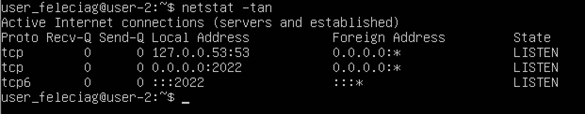

# Замечания: 1. (часть 2) выбрать вариацию скриншотов; 2. проверить часть 3 по тетради 3. часть 5 проверить по тетради 4.  часть 7 доделать скрины 
# Операционные системы UNIX/Linux.

Установка и обновления системы Linux. Основы администрирования.

Проект School 21 D01_Linux-1

  1 [Установка ОС](#part-1-установка-ос)  
  2 [Создание пользователя](#part-2-создание-пользователя)  
  3 [Настройка сети ОС](#part-3-настройка-сети-ос)   
  4 [Обновление ОС](#part-4-обновление-ос)  
  5 [Использование команды  sudo](#part-5-использование-команды-sudo)  
  6 [Установка и настройка службы времени](#part-6-установка-и-настройка-службы-времени)  
  7 [Установка и использование текстовых редакторов](#part-7-установка-и-использование-текстовых-редакторов)  
  8 [Установка и базовая настройка сервиса SSHD](#part-8-установка-и-базовая-настройка-сервиса-sshd)   
  9 [Установка и использование утилит top, htop](#part-9-установка-и-использование-утилит-top-htop)   
  10 [Использование утилиты fdisk](#part-10-использование-утилиты-fdisk)   
  11 [Использование утилиты df](#part-11-использование-утилиты-df)    
  12 [Использование утилиты du](#part-12-использование-утилиты-du)    
  13 [Установка и использование утилиты ncdu](#part-13-установка-и-использование-утилиты-ncdu)    
  14 [Работа с системными журналами](#part-14-работа-с-системными-журналами)     
  15 [Использование планировщика заданий CRON](#part-15-использование-планировщика-заданий-cron)    

## Part 1. Установка ОС

> ##### Установить **Ubuntu 20.04 Server LTS** без графического интерфейса. (Используем программу для виртуализации - VirtualBox)

  
 
  Проверяем версию операционной сиситемы.  
 

  
 

## Part 2. Создание пользователя

> ##### Создать пользователя, отличного от пользователя, который создавался при установке. Пользователь должен быть добавлен в группу `adm`.

  
 
  Выбрать один из двух вариантов скриншотов.  
 

  
 
  Создаем нового пользователя.  
 

  

## Part 3. Настройка сети ОС
> ##### Задать название машины вида user-1  
> ##### Установить временную зону, соответствующую вашему текущему местоположению.  
> ##### Вывести названия сетевых интерфейсов с помощью консольной команды.
> ##### В отчёте дать объяснение наличию интерфейса lo.  
> ##### Используя консольную команду получить ip адрес устройства, на котором вы работаете, от DHCP сервера. 
> ##### В отчёте дать расшифровку DHCP.  
> ##### Определить и вывести на экран внешний ip-адрес шлюза (ip) и внутренний IP-адрес шлюза, он же ip-адрес по умолчанию (gw). 
> ##### Задать статичные (заданные вручную, а не полученные от DHCP сервера) настройки ip, gw, dns (использовать публичный DNS серверы, например 1.1.1.1 или 8.8.8.8).  
> ##### Перезагрузить виртуальную машину. Убедиться, что статичные сетевые настройки (ip, gw, dns) соответствуют заданным в предыдущем пункте.  

 - Проверяем текущее имя машины, далее "mashine_name", командой `hostnamectl`.
 - Устанавливаем новое mashine_name командой `set-hostname new_mashine_name` где `new_mashine_name` новое имя, которое мы хотим установить.
 - Проверяем что все сработало командой `hostname`.

  
 
  Процесс изменения mashine_name.  

  

 - Узнать текущее время и часовой пояс можно командой `date`. Последний столбец в строке говорит какой часовой пояс сейчас установлен на нашей машине. Так же можно узнать часовой пояс командой `timedatectl` в строке *Time zone:* будет указан часовой пояс.

  
 
  Узнать текущее время и часовой пояс.  

  

 - Чтобы установить часовой пояс воспользуемся командой `sudo timedatectl set-timezone Europe/Moskow`, если нужен часовой пояс отличный от выбранного мной то с помощью команды `timedatectl list-timezones` можно узнать другие возможные часовые пояса.

  
 
  Установить часовой пояс.  

  
 - Проверяем что установка часового пояса произошла успешно командой `date`.

  
 
  Сетевые интерфейсы.  

  

  Интерфейс **lo** - *(loopback device)* обозначает виртуальный интерфейс для запуска и отладки сетевых программ на локалной машине, он по умолчанию имеет адрес 127.0.0.1. Он может быть использован сетевым клиентским программным обеспечением, чтобы общаться с серверным приложением, расположенным на том же компьютере. Он уже настроен и доступен в Linux по умолчанию, и вам не нужно ничего дополнительно настраивать.

- Чтобы получить IP-адрес устройства, с которым вы работаете, от сервера DHCP. Используйте команду `hostname -I`.

  

 - Определить внутренний ip адрес устройства можно командой `ip address show` или устаревшей командой `ifconfig`.

  
 
  Внутренний ip адресс устройства.  

  
  

 - Что бы определить внешний ip адрес устройства нужно воспользоваться командой `curl ifconfig.me`, где **curl** служебная программа которая позволяет связываться с различными сервисами для получения сетевой информации.

  
 
  Внешний ip адресс устройства.  

  
  
  - Так же можно воспользоваться командой `wget` и сервисами `eth0.me` или `ident.me` которая создает файл **index.html** при прочтении которого можно узнать внешний ip.

 DHCP - *(англ. Dynamic Host Configuration Protocol — протокол динамической настройки узла)* это сетевой протокол для автоматизации присвоения IP адреса маршрутизатора, IP адреса DNS сервера, масок, доменного имени устройства и другое. Защищает сеть от дублирования IP адресов. Протокол DHCP используется в большинстве сетей TCP/IP.

> *Сетевой протокол – это набор правил и последовательных действий. Исходя из них, устройства, которые находятся в сети, соединяются и обмениваются данными между собой.*

 - Для того что бы задать статичные IP адреса открываем через текстовый редактор vim, nano или что-либо иное файл  из директории /etc/netplan/.
 
 `sudo vim /etc/netplan/00-installer-config.yaml`

- Выключаем протокол dhcp4.

`dhcp4: false`

- Дописывем строки:

`addresses:`              
`gateway4:`              
`nameservers:`                
`addresses:`

 - Перезагружаем машину командой `reboot` и проверяем что заданные настройки были сохранены  `cat /etc/netplan/00-installer-config.yaml`
  
  

  
 
  Ping 1.1.1.1  

  

  
 
  Ping ya.ru  

  

## Part 4. Обновление ОС

> ##### Обновить системные пакеты до последней на момент выполнения задания версии.  

 - Обновляем системные пакеты командой `sudo apt-get upgrade`.

  

## Part 5. Использование команды **sudo**

> ##### Разрешить пользователю, созданному в [Part 2](#part-2-создание-пользователя), выполнять команду sudo.

- В отчёте объяснить *истинное* назначение команды sudo (про то, что это слово - "волшебное", писать не стоит).  

 - Заходим в учетную запись пользователя которого мы создали на [шаге 2].

  
 - Проверяем текущее имя пользователя.

  
 - Изменяем имя машины из под второго пользователя и проверяем что измения сохранились.

  

## Part 6. Установка и настройка службы времени

> ##### Настроить службу автоматической синхронизации времени.  
  

## Part 7. Установка и использование текстовых редакторов 

> ##### Установить текстовые редакторы **VIM** (+ любые два по желанию **NANO**, **MCEDIT**, **JOE** и т.д.)  
> ##### Используя каждый из трех выбранных редакторов, создайте файл *test_X.txt*, где X -- название редактора, в котором создан файл. Напишите в нём свой никнейм, закройте файл с сохранением изменений. 
> ##### Используя каждый из трех выбранных редакторов, откройте файл на редактирование, отредактируйте файл, заменив никнейм на строку "21 School 21", закройте файл без сохранения изменений.
> ##### Используя каждый из трех выбранных редакторов, отредактируйте файл ещё раз (по аналогии с предыдущим пунктом), а затем освойте функции поиска по содержимому файла (слово) и замены слова на любое другое.

- Что бы начать работать с текстовым файлом не обязательно предварительно его создавать, комады текстовых редакторов могут создать и сразу войти в файл для редактирования. Например вводим команду `vim test_vim_2.txt`, и сразу оказываемся в окне рдактирвания. Для начала редактирвания файла через **vim** нажмите клавишу `I`, что бы выйти из режима редактирования, и в последствии выйти из файла, нажмите `esc`. 

  
 
  Текстовый редактор Vim  

  
  
  

 - Что бы сохранить изменения и выйти есть несколько способов, например:
   1) Способ - комбинация клавиш `Shift + Z + Z`, которая сохранит файл и вернет нас в рабочую зону терминала. 
   2) Способ - вводим `:wq`, где после `:` спецсимвол после которого могут идти различные команды, `w` - сохранить изменения, `q` - выйти из файла.

  
 
  Способ №2  

  
  

  
 - Повторим наши операции в редакторе  **nano**. В отличии от **vim**, здесь можно сразу начать редактирование файла сразу после входа. Сохранить изменения в файле можно комбинацией `^O` или при выходе из файла.

  
 
  Текстовый редактор Nano  

   
   

 - Для выхода испозьзуем комбинацию `^X`, после чего редактор спросит нужно ли сохранть изменения. Нажимаем `Y` - подтвердить. После чего будет предложена возможность поменять имя файла в который мы сохраняем изменения.

  
  

 - Теперь проделам те же операции в текстовом редакторе **joe**. Здесь, как и в **nano**, печатать можно сразу при в ходе в редактор. Для сохранения файла используем комбинацию `^K - D` и `^K - X` для выхода. При выходе будет предложено изменить имя файла, просто нажимаем `Enter` если нас все устраивает.

  
 
  Текстовый редактор Joe  

  
  
  

 Что делать если не хочется сохранять изменения.

  
  - **В текстовом редактроре *vim* достаточно при выходе написать `:q!`**

  
 
  Vim выход без сохранения  

  
  
  

  - **В текстовом редакторе *nano* выходим сочетанием `^X` и `N` что бы не сохранять изменения**

  
 
  Nano выход без сохранения  

  
  

  - **В текстовом редакторе *joe* выходим сочетание `^C` и `Y` что бы не сохранять изменения**

  
 
  Joe выход без сохранения  

  
  

 Для поиска текста в файле.

  - **В текстовом редактроре *vim* пишем команду `:s/desired/replacement` где *desired* -  искомое *replacement* - то на что мы хотим заменить. Для замены всех совпадений в строке `:s/desired/replacement/g` дописываем `g`. Для замены всех совпадений `:%s/desired/replacement/g` дописываем `%` в начале строки.**

  
 
  Vim поиск и замена  

  
  
  
  

  - **В текстовом редакторе *nano* для поиска используем сочетанием `^\` и вводим искомое и на что заменить после чего подтверждаем операцию**

  
 
  Nano поиск и замена  

  
  
  
  
  
  
  
  

  - **В текстовом редакторе *joe*  для поиска используем сочетание `^K - F` вводим искомое, через клавишу `b` устанавливаеи курсор на том что хотим заменить `r` что бы ввести на что хотим заменить и `y`/`n` для подтверждения/отмены изменения**

  
 
  Joe поиск и замена  

  
  
  
  
  
  
  

## Part 8. Установка и базовая настройка сервиса **SSHD**

> ##### Установить службу SSHd.  
> ##### Добавить автостарт службы при загрузке системы.  
> ##### Перенастроить службу SSHd на порт 2022.  
> ##### Используя команду ps, показать наличие процесса sshd. > Для этого к команде нужно подобрать ключи.

 - Устанавливаем службу "" командой `sudo apt-get install ssh`.
 - Изменяем порт работы SSH службы на 2022

  
 
  Файл конфигурации SSH службы 

 

 - перезапускаем ssh службу что бы измененмя вступили в силу
 
 - Запускаем команду `ps -Af | grep ssh` для поиска процесса `ssh` испольщуем команду.
 В команде `ps -Af | grep ssh` флаг:
   - `A` - показывает все процессы
   - `f` - показывает всю информацию по процессу
   - командой  `|grep ssh` выделяем нужное

 - Запускаем команду `netstat -tan`.
 В команде `netstat -tan` флаг:
   - `a` - Отображение всех подключений и ожидающих портов.
   - `t` - Выделят все ТСР соединения.
   - `n` - Отображение адресов и номеров портов в числовом формате. 

   - `Proto`: имя протокола (протокол TCP или протокол UDP);
   - `recv-Q`: очередь на получение сети;
   - `end-Q`: очередь на отправку сети; 
   - `Local Address`: адрес локального компьютера и номер используемого порта;
   - `Foreign` Address: адрес и номер удаленного компьютера, к которому подключен сокет;
   - `State`: состояние сокета;
   - `0.0.0.0` - означает IP-адрес локального компьютера.

## Part 9. Установка и использование утилит **top**, **htop**

> ##### Установить и запустить утилиты top и htop.  

 - uptime: 20min
 - количество авторизованных пользователей: 1
 - общая загрузку системы: 0.00, 0.00, 0.00

 - общее количество процессов: 91

 - загрузкa cpu: 0.0 us, 0.0 sy, 0.0 ni
 - загрузкa памяти: 5827.0 total

 - pid процесса занимающего больше всего памяти: 661

  
 
  Вывод команды top 

 - pid процесса, занимающего больше всего процессорного времени: 0.3

- В отчёт вставить скрин с выводом команды htop:

  
 
  Вывод команды htop отсортированная по PID, PERCENT_CPU, PERCENT_MEM, TIME

    
    -сортировка по PID 

    -сортировка по PERCENT_CPU

    -сортировка по PERCENT_MEM

    -сортировка по TIME

  
 
  Вывод команды htop отфильтрованный для процесса sshd

  
 
  Вывод команды htop с процессом syslog

  
 
  Вывод команды htop с добавленным выводом hostname, clock и uptime

## Part 10. Использование утилиты **fdisk**

> ##### Запустить команду fdisk -l.
- В отчёте написать название жесткого диска, его размер и количество секторов, а также размер swap.

  
 
  Вывод команды fdisk_-l

  - Наименование жесткого диска /dev/sba
  - Размер жесткого диска:
    - В Gb 8
    - В bytes 8589934592
  - Количество секторов 16777216
  - Swap

## Part 11. Использование утилиты **df** 

> ##### Запустить команду df. 
> ##### Запустить команду df -Th.

  
 
  Вывод команды df 

 - Размер корнегого раздела: 6352332 Kbytes
 - Размер занятого пространства: 2745500 Kbytes
 - Размер свободного пространства: 3262976 Kbytes
 - Процент использования: 46%

  
 
  Вывод команды df -Th

 - размер раздела: 6.1 Gbytes
 - размер занятого пространства: 2.7 Gbytes
 - размер свободного пространства: 3.2 Gbytes
 - процент использования: 46%

## Part 12. Использование утилиты **du**

> ##### Запустить команду du.
> ##### Вывести размер папок /home, /var, /var/log (в байтах, в человекочитаемом виде)
> ##### Вывести размер всего содержимого в /var/log (не общее, а каждого вложенного элемента, используя *)
 - Для печати в человекочитаемом виде используем флаг `-h`.

  
 
  Вывод команды du и du -h

## Part 13. Установка и использование утилиты **ncdu**

> ##### Установить утилиту ncdu.
> ##### Вывести размер папок /home, /var, /var/log.

  
 
  Вывод команды ncdu 

  
 
  Вывод команды ncdu /var/

  
 
  Вывод команды ncdu /log/

## Part 14. Работа с системными журналами

> ##### Открыть для просмотра:
> ##### 1. /var/log/dmesg
> ##### 2. /var/log/syslog
> ##### 3. /var/log/auth.log  

- Время последней успешной авторизации: Jul 24 20:51:53
- Имя пользователя: user_feleciag
- Метод входа в систему: pam_unix

- Перезапустить службу SSHd.

- Вставить в отчёт скрин с сообщением о рестарте службы (искать в логах).

## Part 15. Использование планировщика заданий **CRON**

> ##### Используя планировщик заданий, запустите команду uptime через каждые 2 минуты.
> ##### Удалите все задания из планировщика заданий.

``