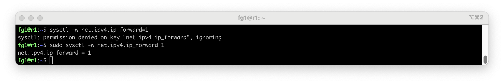
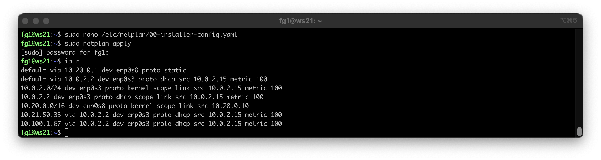
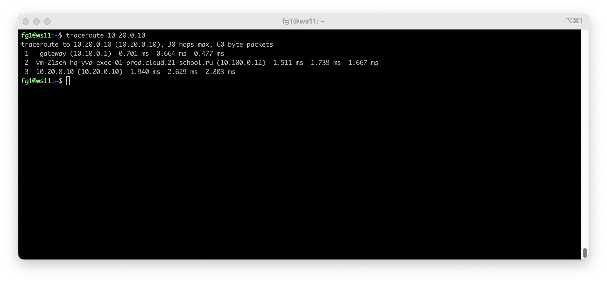

# DO2_LinuxNetwork 
## Сети Адресация Маршрутизация NAT

  1 [Инструмент ipcalc](#part-1-инструмент-ipcalc)\
    - 1.1 [Сети и маски](#11-сети-и-маскиpart)\
    - 1.2 [localhost](#12-localhost)\
    - 1.3 [Диапазоны и сегменты сетей](#13-диапазоны-и-сегменты-сетей)\
  2 [Статическая маршрутизация между двумя машинами](#part-2-cтатическая-маршрутизация-между-двумя-машинами)\
    - 2.1 [Добаяем статический маршрут вручную](#21-добаяем-статический-маршрут-вручную)\
    - 2.2 [Добаяем статический маршрут с сохранением](#22-добаяем-статический-маршрут-с-сохранением)\
  3 [Утилита iperf3](#part-3-утилита-iperf3)\
    - 3.1 [Скорость соединения](#31-скорость-соединения)\
  4 [Сетевой экран](#part-4-сетевой-экран)\
    - 4.1 [Утилита iptables](#41-утилита-iptables)\
    - 4.2 [Утилита nmap](#42-утилита-nmap)\
  5 [Статическая маршрутизация сети](#part-5-статическая-маршрутизация-сети)\
    - 5.1 [Настройка адресов машин](#51-настройка-адресов-машин)\
    - 5.2 [Включение переадресации IP-адресов](#52-включение-переадресации-ip-адресов)\
    - 5.3 [Установка маршрута по-умолчанию](#53-установка-маршрута-по-умолчанию)\
    - 5.4 [Добавление статических маршрутов](#54-добавление-статических-маршрутов)\
    - 5.5 [Построение списка маршрутизаторов](#55-построение-списка-маршрутизаторов)\
    - 5.6 [Использование протокола ICMP при маршрутизации](#56-использование-протокола-icmp-при-маршрутизации)\
  6 [Динамическая настройка IP с помощью DHCP](#part-6-динамическая-настройка-IP-с-помощью-DHCP)\
  7 [NAT](#part-7-nat)\
  8 [SSH Tunnels](#part-8-ssh-tunnels)\

### Part 1 Инструмент ipcalc

  `ipcalc` - Команда в Linux используется для выполнения простых манипуляций с IP-адресами, таких как вычисление диапазона хостов, широковещательной рассылки, сети и маски подстановочных знаков cisco. Он принимает сетевую маску и IPv4-адрес и возвращает полную информацию об IP-адресе хоста.
#### 1.1 Сети и маски
   
  
  Адрес сети `192.167.38.54/13` = `11000000.10100111.00100110.001110110` 

  
 
  Вычисление маски по таблице.  
 

  

  Перевод маски сети 255.255.255.0: 
  1. Двоичная маска 11111111.11111111.11111111.00000000
  2. Префиксная маска /24  \
  

  Перевод маски сети /15: 
  1. Двоичная маска 11111111.11111110.00000000.00000000
  2. Десятичная маска 255.254.0.0 \
  
  

  Перевод маски сети 11111111.11111111.11111111.11110000: 
  1. Префиксная маска /28
  2. Десятичная маска 255.255.255.240 \
  

  Хост в сети 12.167.38.4:
  1. При маске /8: \
    - Минимальный 12.0.0.1 \
    - Максимальный 12.255.255.254
  
  2. При маске 11111111.11111111.0.0: \
    - Минимальный  12.167.0.1 \
    - Максимальный 12.167.255.254 \
  
  3. При маске 255.255.254.0: \
    - Минимальный  12.167.38.1 \
    - Максимальный 12.167.39.254 \
  
  4. При маске /4: \
    - Минимальный  0.0.0.1 \
    - Максимальный 15.255.255.255 \
  

#### 1.2 localhost
  Можно ли обратиться к приложению, работающему на localhost, со следующими IP: 
  - 194.34.23.100 - нет 
  - 127.0.0.2 - да
  - 127.1.0.1 - да 
  - 128.0.0.1 - нет \
  
#### 1.3 диапазоны и сегменты сетей 
  Под частные сетевые диапазоны выделены:
  - 10.0.0.0 — 10.255.255.255 (маска подсети для бесклассовой адресации: 255.0.0.0 или /8);
  - 100.64.0.0 — 100.127.255.255 (маска подсети 255.192.0.0 или /10);
  - 172.16.0.0 — 172.31.255.255 (маска подсети: 255.240.0.0 или /12);
  - 192.168.0.0 — 192.168.255.255 (маска подсети: 255.255.0.0 или /16).
  Сравнить вручную первые два диапазона сети или проверить строчку Hosts/Net  команды `ipcalc`

  
  Какие из перечисленных IP можно использовать в качестве публичного, а какие только в качестве частных: 
  - 10.0.0.45 - Частный адрес
  - 134.43.0.2 - Публичный адрес
  - 192.168.4.2 - Частный адрес
  - 172.20.250.4 - Частный адрес 
  - 172.0.2.1 - Публичный адрес
  - 192.172.0.1 - Публичный адрес
  - 172.68.0.2 - Публичный адрес
  - 172.16.255.255 - Частный адрес
  - 10.10.10.10 - Частный адрес
  - 192.169.168.1 - Публичный адрес

 Какие из перечисленных IP адресов шлюза возможны у сети 10.10.0.0/18:\
 
 (доступный диапазон 10.10.0.1 - 10.10.63.254)
 - 10.0.0.1 - не возможен 
 - 10.10.0.2 - возможен 
 - 10.10.10.10 - возможен 
 - 10.10.100.1 - не возможен 
 - 10.10.1.255 - возможен

### Part 2 Статическая маршрутизация между двумя машинами

  
 
  Создание виртуальных машин.  
 

  

 

  Включаем дополнительные адаптеры в Virtual-Box что бы не потерять подключение в интернет.
  
  Задаем новые статические адреса для виртуальных машин: 
  - ws1 192.168.100.10/16 \
 
  - ws2 172.24.116.8/12 \
 

#### 2.1. Добаяем статический маршрут вручную
  Соединяем машины по ip и пингуем соединение: \
  
  
  
  
  *Соединение установлено, все пакеты между машинами передаются*

#### 2.2. Добаяем статический маршрут с сохранением
  Перезпускаем машины. \
  
  
  Статическое соедининеие было разорвано.
  

  Меняем кофиг файл `/etc/netplan/00-installer-config.yaml` что бы при перезапуске настройки соединения сохранялись и проверяем соединение.
  
  

### Part 3 Утилита iperf3

  `iperf3`  - консольная клиент-серверная утилита — генератор TCP и UDP трафика для тестирования пропускной способности сети.  

#### 3.1. Скорость соединения
  Конвертировать:

|From    | To  |
|--------|-----|
|8 Mbps  | 1 MB/s|
|100 MB/s| 800000 Kbps|
|1 Gbps  | 1000 Mbps  |

*Mbps (мегабит в секунду) - это мера скорости передачи данных, используемая для оценки пропускной способности сети и скорости интернет-соединений.* \
*MB/s (мегабайт в секунду) - это мера скорости передачи данных, используется в контексте объема данных, передаваемых или записываемых за секунду на устройства хранения данных, такие как жесткие диски, SSD или флеш-накопители.*  \
*В одном мегабайте 8 мегабит.*

#### Part 3.1 Утилита iperf3

На машине ws1 запускаем утилиту через команду `iperf3 -s`, она будет выступать в роли сервера и просушиать соединения.

На машине ws2 подключаемся к первой машине и производим замер скорости с помошью команды `iperf3 -c 192.168.100.10 -f m`

Где флаг `-f` или `--format` означает формат вывода данных

 | | |
 |----|----|
 | k | kbps|
 | m | mbps|
 | g | gbps|
 | t | tbps|
 | K | KB/s|
 | M | MB/s|
 | G | GB/s|
 | T | TB/s|
 
Столбцы вывода сервера:
 - ID: Уникальный идентификатор соединения.
 - Interval: Временной интервал, для которого показываются данные.
 - Transfer: Объем данных, который был принят сервером за указанный интервал.
 - Bitrate: Средняя скорость передачи данных, здесь выраженная в гигабитах в секунду.
 
Столбцы вывода клиента:
 - ID: Уникальный идентификатор соединения.
 - Interval: Временной интервал, в течение которого производились замеры, выраженный в секундах.
 - Transfer: Объём данных, переданных за время интервала.
 - Bitrate: Средняя пропускная способность за время интервала, выраженная в мегабайтах в секунду (MBytes/sec).
 - Retr: Количество повторных передач (retransmissions), которые пришлось совершить из-за потери пакетов.
 - Cwnd (Congestion Window): Размер окна перегрузки в мегабайтах, который контролирует количество байт, которые могут быть отправлены без подтверждения приема.

### Part 4 Сетевой экран
#### 4.1 Утилита iptables

`iptables` - инструмент управления сетью в Linux, который позволяет администраторам управлять входящими и исходящими пакетами данных на основе набора правил, которые определяют, как обрабатывать различные виды трафика.

Создаём файл /etc/firewall.sh, имитирующий фаерволл, на машинах ws1 и ws2, и ему даем права на исполнение *(`x` - Execute)* командой `chmod +x /etc/firewall.sh` 

После исполнения файла пытаемся проверить связь между машинами командой `ping "ip address"`.

Результат, первая машина получает ответы от второй, а вторая от первой нет. Это обьясняется тем что команда которая идет раньше имеет больший приоритет чем последущая команда. При отправке запросов и проверке фильтров сети первое правило встречается раньше второго и прерывает дальнейшую проверку правил.  

#### 4.2 Утилита nmap

`nmap` *(network mapper)* - это утилита, предназначенная для разнообразного настраиваемого сканирования IP-сетей с любым количеством объектов, определения состояния объектов сканируемой сети (портов и соответствующих им служб). Может быть использован для проверки безопасности, просто для определения сервисов запущенных на узле, для идентификации ОС и приложений, определения типа фаерволла используемого на сканируемом узле.

В предыдущем скриншоте мы увидели что машина ws1 не пингуется, но это еще не значит что у неё запрет на ответ, может она выключена. Еще раз пингуем адресс 192.168.100.10. А теперь проверяем командой `nmap -sP 192.168.100.10` запущен ли хост по этому адрессу.

`-sP`- Пинг сканирование - флаг позволяет определить, работает ли хост.

*Host is up - машина ws1 включена*

### Part 5 Статическая маршрутизация сети
Поднимамаем пять виртуальных машин (3 рабочие станции (ws11, ws21, ws22) и 2 роутера (r1, r2)).

*Вкючаем дополнительные порты для соединения машин, для роутеров дополнительно еще один для соединения их между собой*
#### 5.1. Настройка адресов машин
Прописываем конфигурацию сети для роутеров.

Применяем настройки и проверяем их соединение между собой.

Проверяем командой `ip -4` a проверь, что адрес машин задан верно. 

Прописываем конфигурацию сети для рабочих станций.

Применяем настройки для ws11 и проверяем соединение с роутером.

Применяем настройки для ws21 и ws22 и проверяем соединение между ними и роутером.

#### 5.2. Включение переадресации IP-адресов.

Для переадресации IP-адрессов на роутерах включаем её командой `sysctl -w net.ipv4.ip_forward=1`. Такой способ будет работать до перезагрузки роутера.

Для постоянной переадресации расскоментируем строку `net.ipv4.ip_forward = 1` в файле конфиграции `/etc/sysctl.conf`

#### 5.3. Установка маршрута по-умолчанию

Теперь настрем маршрут по-умолчанию (шлюз) для рабочих станций.\
*Основной шлюз (установленный по умолчанию, default gateway) — является главным, он обрабатывает все пакеты данных, которые отправляются узлом за пределы его локальной сети в интернет или просто в другую подсеть. Т.е. если ПК не знает куда отправлять пакеты данных, то он обращается к основному сетевому шлюзу. (не знает, это значит нет подключенного маршрута или более точного)*\
Командой `ip r` посмотрим текущие настройки маршрутов на машинах.

Меняем файл конфигурации `etc/netplan/00-installer-config.yaml.` на машинах.

Дефолный маршрут для рабочей машины №11

Дефолный маршрут для рабочей машины №21

Дефолный маршрут для рабочей машины №22

Рабочая машина отправляет сигнал на роутер 2 и он доходит, но не получает ответа о достигнутом сигнале.

`tcpdump` - это утилита UNIX (есть клон для Windows), позволяющая перехватывать и анализировать сетевой трафик, проходящий через компьютер, на котором запущена данная программа. Утилита tcpdump позволяет проверять заголовки пакетов TCP/IP и выводить одну строку для каждого из пакетов.

`-i` - Указывает на то, какой сетевой интерфейс будет использоваться для захвата пакетов. По умолчанию — eth0, для выбора всех интерфейсов — any. Если отсутствует локальная сеть, то можно воспользоваться интерфейсом обратной связи lo.\
`-t` - Не отображает метку времени в каждой строке.\
`-n` - Отображает IP-адрес вместо имени хоста. Без этого флага tcpdump пытается разрешить численные IP-адреса и номера портов в соответствующие доменные имена и имена сервисов, что может замедлить отображение данных.

#### 5.4. Добавление статических маршрутов
Прописываем статические маршруты в роутерах

Измененные маршуруты теперь выглядят так:

Маршрут по умолчанию выбирается только в том случае, если нет других маршрутов, заданных вручную. При наличии нескольких маршрутов, выбирается тот у которого больше значение маски подсети, а значит адрес с маской 0 не будет выбран, если есть другой.

#### 5.5. Построение списка маршрутизаторов
При помощи утитлиты `traceroute` мы видим весь путь пакетов от ws11 до машины ws21. А утилита `tcpdump` нам показывает весь путь пакета от одной машины до другой.

Если добавить флаг `-v` то можно увидеть подробную информацию из заголовка tcp пакета например:
**ttl** - время жизни пакета *1 - означает что будет уничтожен после первого хопа*
**id** - индефикатор пакета
**offset** - смещение фрагмента в пакете
**proto** - протокол передачи данных
**lenght** - длинна пакета в байтах

Так же из передыдущего скриншота мы видем *ARP* запросы и ответы которые подтвержают нормальную работу сети

#### 5.6. Использование протокола ICMP при маршрутизации
А теперь попробуем пропинговать неизвестный нашей локальной сети ip.\
Запросы проходят через роутер 1 но ответа мы не получаем.

### Part 6 Динамическая настройка IP с помощью DHCP
Теперь попробуем настроить автоматизацию через службу DHCP.
Создаем файл конфигурации /etc/dhcp/dhcpd.conf

И меняем nameserver в файле `/etc/resolv.conf` 

Разрешаем автозапуск сервиса командой `systemctl enable isc-dhcp-server`.\
Перезагружаем настройки DHCP сервера `systemctl restart isc-dhcp-server`

Перезагружаем ws21, видим что адрес не поменялся

Включаем dhcp на втором интерфейсе и перезагружаем еще раз

Теперь IP адрес был выдан автоматически.

Делаем тоже самое для машины ws22 и пингуем её с машины ws 21

Прописываем вручную МАС-адресс для машины ws11 и так же включаем DHCP сервис в файле конфигурации *etc/netplan/00-installer-config.yaml* 

Тоже самое не забываем сделать в настройках сети виртуальной машины.

На роутере r1 прописываем настройки для этой подстеи с жесткой привязкой к mac-адресу машины ws11.\

Перезагружаем машину и проверяем что МАС-адрес сохранился и нам выдали тот ip-адрес который был прописн в файле конфигурации DHCP-сервиса */etc/dhcp/dhcpd.conf* на роутере r1.

Пингуем роутер

А для машины ws21 попробуем запросить новый ip-адрес, для этого проверим текущий адресс командой `ip -4 a` и сбросим настройки dhcp-сервиса для порта *enp0s8* командой `dhclient -r enp0s8`

Обновим ip сделав широковещательный запрос в сеть командой `dhclient` и снова проверим адрес 

### Part 7 NAT

Для начала выполнения этого задания загружаем ПО для работы с Apache2 сервером командой `apt install apache2`.\
Далее в файле /etc/apache2/ports.conf на ws22 и r1 изменям строку Listen 80 на Listen 0.0.0.0:80, то есть делаем сервер Apache2 общедоступным.

И запускаем веб-сервер Apache командой `service apache2 start` на машине ws22 и роутере r1

Создаем фаервол аналогично фаерволу из [Части 4](#part-4-сетевой-экран) фаервол на роутере r2 и запускаем его

На машине ws22 пингуем роутер r1 и видим что он не пингуется из-за настроек фаервола

Дописываем правило которое разрешит маршрутизацию всех пакетов протокола ICMP и еще раз запускаем файл фаервола

Теперь у нас получается пинггануть роутер r1

Добавляем еще парочку правил. Включаем SNAT - маскировку всех локальных ip из локальной сети 10.20.0.0. 

И Включаем DNAT на 8080 порт машины r2 и добавить к веб-серверу Apache доступ из внешней сети

`iptables -A FORWARD -p tcp --dport 80 -j ACCEPT` - Разрешаем входящие пакеты в 80 порту по tcp протоколу\
`iptables -A FORWARD -m state --state ESTABLISHED -j ACCEPT` - Разрешаем установленные и связвнные соединения\
`iptables -A FORWARD -i enp0s9 -o enp0s8 -j ACCEPT` - Даем доступ к передаче пакетов от одного порта к другому/
`iptables -t nat --append POSTROUTING -s 10.20.0.0/26 -o enp0s9 -j MASQUERADE` - Маскеруем все исходящие запросы из сети **10.20.0.0/26** по протоколу SNAT\
`iptables -t nat --append PREROUTING  --protocol tcp --dport 8080 -j DNAT --to-destination 10.20.0.3:80` - Перенаправляем входящие запросы на порт **8080** на адрес **10.20.0.3**, *Если вы хотите что бы запросы перенаправлялись на одну и ту же машину, стоит настроить для неё статический ip-адрес*.

*Перед тестированием рекомендуется отключить сетевой интерфейс NAT (его наличие можно проверить командой ip a) в VirtualBox, если он включен*

Командой `telnet [адрес] [порт]` проверяем соединение по TCP для SNAT сначала от машины ws22 до роутера r1 потом наоборот от роутера r1 до машины ws22 \

### Part 8 SSH Tunnels

Для выполнения этого задания мы используем те же настройки фаервола что и для [Part 7](#part-7-nat)

В файле */et/apache2/ports.conf* меняем строку `Listen 80` на `Listen localhost:80`

Для локального подключения Local TCP forwarding с ws21 до ws22 используем команды `ssh 10.20.0.3` на машине ws21

Для удаленного подключения Remote TCP forwarding до ws11 с ws22 используем команду `` на машине ws22

