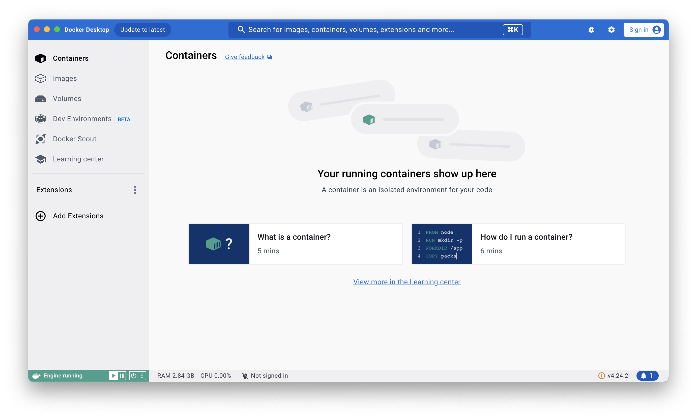

# DO5_Simple Docker 
## Simple Docker


  1 [Готовый докер](#part-1-готовый-докер)\
  2 [Операции с контейнером](#part-2-операции-с-контейнером)\
  3 [Мини веб-сервер](#part-3-мини-веб-сервер)\
  4 [Свой докер](#part-4-свой-докер)\
  5 [Dockle](#part-5-dockle)\
  6 [Базовый Docker Compose](#part-6-базовый-docker-compose)

### Part 1 Готовый докер

Обязательно запускаем приложение что бы зарабтал *Docker Engine*.
 
На сервисе *DockerHub* ищем **nginx** для подсказок по работе с образом.
 
 


Скачиваем официальный докер-образ с **nginx** и выкачай его при помощи `docker pull`. \
 
*Без указания версии все скачивается последняя*

Проверяем наличие докер-образа через `docker images`. \
 

Запустим докер-образ через `docker run -d [image_id|repository]`. \
 
*`-d` - (`--detach`) флаг запускает контейнер в фоновом процессе, который не занимает окно терминала*

Проверим, что образ запустился через `docker ps`. \
 
*по умолчанию показывает только запущенные контейнеры в локальном репозитории*

Посмотрим информацию о контейнере через `docker inspect [container_id|container_name]`. \
 
 

По выводу команды определи и помести в отчёт размер контейнера, список замапленных портов и ip контейнера. \
 
Ip-addres образа - 172.17.0.2 \
`ConsoleSize` - этот параметр определяет размер консоли контейнера в терминах строк и столбцов. Значение отображается в виде массива, например [x, y]. \
`ShmSize` - определяет размер разделяемой памяти (shared memory), которая выделена для контейнера. Значение указывается в байтах. \
`SizeRw` - (read-write size) указывает размер изменяемых данных контейнера. Это количество данных, которые были записаны в слой для чтения и записи контейнера после его создания и старта. Это позволяет понять, сколько дополнительных данных было сохранено в контейнере после его запуска. \
`SizeRootFs` - (root filesystem size) обозначает общий размер корневой файловой системы контейнера. 

 
`ExposedPorts` - Этот раздел конфигурации указывает, какие порты внутри контейнера объявлены как "открытые" или "выставленные наружу" (exposed). Это описание, которое само по себе не приводит к пробросу портов на хост, но служит информацией для пользователя или других сервисов о том, какие порты предполагается использовать. \
`Ports` - указывает конкретные порты или диапазоны портов, которые выставлены из контейнера. В конкретном случае образ слушает 80 порт, но мы не соеденили его ни с каким из портом нашей рабочей машины.


Остановим докер образ через `docker stop [container_id|container_name]`. \
 
*для того что бы обратиться к образу не обязательно указывать полный id*

И проверим, что образ остановился через `docker ps`. \
 

Запусти докер с портами 80 и 443 в контейнере, замапленными на такие же порты на локальной машине, через команду `docker run -d nginx -p 80:80 443:443`. \
 

Проверим, что в браузере по адресу *localhost:80* доступна стартовая страница nginx. \
 

Перезапустим докер контейнер через `docker restart [container_id|container_name]`. \
 

И проверим любым способом, что контейнер запустился. \
`docker ps` \
 

### Part 2 Операции с контейнером
Найдем и прочитаем конфигурационный файл *nginx.conf* внутри докер контейнера через команду `exec`. \
 
 

Создадим на локальной машине файл *nginx.conf*. \
И настроим в нем по пути **/status** отдачу страницы статуса сервера **nginx**. \
 

Добавим строки к существующему файлу конфигурации:
```
server {
    listen 80;
    location /nginx_status {
        stub_status;
        allow 127.0.0.1;    #достп к запросу статуса только через localhost
    }
}
```
*Закомментировал строку `include /etc/nginx/conf.d/*.conf;`, с ней не возвращал статус.*

Скопируем созданный файл *nginx.conf* внутрь докер-образа через команду `docker cp`. \
И сразу проверим что файл конфигурации написан правильно командой `nginx -t`. \
 \
*`nginx: configuration file /etc/nginx/nginx.conf test is successful` - файл конфигурации исправен*

Перезапустим **nginx** внутри докер-образа через команду `exec`, и проверяем, что по адресу *localhost:80/status* отдается страничка со статусом сервера **nginx**. \
 
 
 

 
Экспортируем контейнер в файл **container.tar** через команду export. \
 

Остановим контейнер `docker stop [image_id| image_name]`. \
 

Удалим образ через `docker rmi [image_id|repository]`, не удаляя перед этим контейнеры. Командой `docker images` перепроверяем что образа не осталось. \
 
*Ошибка предупреждает о том что у нас есть контейнер который использует образ nginx. Что бы удалить образ используем флаг `--force`, будте осторожны, особенно если до этого была скачена latest версия.*

Удалим остановленный контейнер. \
 

После импортируем контейнер обратно через команду `import`. \
 
*Ошибка запуска. В контейнере при запуске не указана команда которую следует исполнить.*

Удаляем предыдущую попытку импорта и добавляем спецификаторы при импорте контейнера `--change='ENTRYPOINT ["nginx", "-g", "daemon off;"]'`. 
Запускаем импортированный контейнер. \
 
*Можно пойти и другими путями, например добавить после `docker run` команду которая будет исполнена при запуске контейнера или переписать образ через докер файл*

И проверяем, что по адресу *localhost:80/status* отдается страничка со статусом сервера **nginx**. \
 
 


### Part 3 Мини веб-сервер
Mини-сервер на C и FastCgi, будет возвращать простейшую страничку с надписью ***Hello World!***.
 

Запусти написанный мини-сервер через ***spawn-fcgi*** на порту *8080*.
 

`spawn-fcgi` — это инструмент, который помогает запускать FastCGI программы. Он запускает приложение в фоновом режиме (как демон), и это приложение остаётся запущенным, готовым обслуживать множество запросов. Веб-сервер перенаправляет запросы в это приложение через FastCGI.
**FastCGI** — это протокол, позволяющий интерфейсу веб-сервера общаться с приложением для обработки содержимого веб-страниц.

Напишем свой *nginx.conf*, который будет проксировать все запросы с **:81** порта извне контейнера на **127.0.0.1:8080** внутри.
И поместим его в контейнер по пути *./nginx/nginx.conf*.
 
 

Теперь в браузере по *localhost:81* отдается написанная страничка с надписью *Hello World!*.
 
 

### Part 4 Свой докер
Напишем свой докер-образ *(image)*, который:

1) собирает исходники мини сервера на FastCgi из [Части 3](#part-3-мини-веб-сервер);
2) запускает его на 8080 порту;
3) копирует внутрь образа написанный ./nginx/nginx.conf;
4) запускает nginx.
 

Собери написанный докер-образ через `docker build` при этом указав имя и тег командой `docker build . --tag fg/parth_4 --file Dockerfile`.
Проверим через `docker images`, что все собралось корректно.

И запустим собранный докер-образ с маппингом 81 порта на 80 на локальной машине и маппингом папки ./nginx внутрь контейнера по адресу, где лежат конфигурационные файлы nginx'а [(см. Часть 2)](#part-2-операции-с-контейнером).
`docker run -d --rm --name parth_4 -v $(pwd)/nginx:/etc/nginx -p 80:81 fg/parth_4`
 
`-v $(pwd)/nginx:/etc/nginx` - связываем локальную папку с конфигурацией *nginx* и папку внутри контейнера

По *localhost:80* доступна страничка написанного мини сервера.
 

Допишем в *./nginx/nginx.conf* проксирование странички */status*, по которой надо отдавать статус сервера *nginx*.
 

После сохранения файла и перезапуска контейнера, конфигурационный файл внутри докер-образа обновился самостоятельно без лишних действий

Теперь по *localhost:80/status* отдается страничка со статусом nginx
 
 

### Part 5 Dockle
Просканируйем образ из предыдущего задания через `dockle [image_id|repository]`.
 

*Сейчас dockle требует права админа на школьных мак, поэтому запускаем проверку образа в контейнере.*

`-v /var/run/docker.sock:/var/run/docker.sock` - монтируем том. В данном случае, Docker сокет на хост-машине **(/var/run/docker.sock)** монтируется в контейнер по тому же пути. Это позволяет контейнеру взаимодействовать с Docker демоном хоста, используя этот сокет, что даёт контейнеру возможность управлять другими контейнерами на хост-машине. *Доступ к этому сокету эквивалентен правам суперпользователя, так как атакующий, контролирующий сокет, может запускать контейнеры Docker с любыми параметрами, включая монтирование /root и доступ к системным процессам.* \
`goodwithtech/dockle`- образ dockle внутри контейнера. Dockle — это инструмент для безопасности контейнеров, который анализирует образы на предмет уязвимостей и практик безопасности. \
`fg/parth_5` - аргумент, передаваемый в контейнер при запуске. Docker образ, который должен быть проанализирован с помощью *Dockle*.

Теперь исправим образ так, чтобы при проверке через **`dockle`** не было ошибок и предупреждений.

 
Дописываем при команде `build` тэг `fg/parth_5`**`:1.0`** что бы убрать предупреждение **DKL-DI-0006**.
INFO **CIS-DI-0005** - добавляем `export DOCKER_CONTENT_TRUST=1` перед билдом образа.

 
Для того что бы максимально облегчить образ делим сборку контейнера на несколько этапов, сборку файла сервера производим в контейнере **gcc** из которого потом переносим исполняемый файл в наш контейнер **nginx**. Так же что бы облегчит контейнер и бы убрать ошибку **DKL-DI-0005**, удаляем кэш файлы менеджера загрузок `rm -rf /var/lib/apt/lists`. \
Убираем предупреждение **CIS-DI-0001** поменяв юзера *root* на *nginx*
Так же создаем и копируем в контейнер скрип запуска сервера **run.sh**, для облегчения пересборки образа.

INFO **CIS-DI-0006** - добаляем провергу состояния сервера, и **CIS-DI-0008** - меняем права исполнения от текущего пользователя/группы (вместо суперпользователя).

Пересобираем контейнер и проверяем на безопастность.
 

И, напоследок, проверяем что сервер работает и отдает нашу страничку с `Hello World!`.
 

### Part 6 Базовый Docker Compose
Теперь развернем работу сразу нескольких контейнеров через **docker compose**. \
*Docker Compose используется для одновременного управления несколькими контейнерами, входящими в состав приложения. Этот инструмент предлагает те же возможности, что и Docker, но позволяет работать с более сложными приложениями. Позволяет запускать множество контейнеров одновременно и маршрутизировать потоки данных между ними.*


Файл docker-compose.yml, с помощью которого: 
1) Поднимается докер-контейнер из [Части 5](#part-5-dockle) (он будет работать в локальной сети, т.е. не нужно использовать инструкцию EXPOSE и мапить порты на локальную машину). \
2) Поднимается докер-контейнер с *nginx*, который будет проксировать все запросы с **8080** порта на **81** порт первого контейнера. \
 
*Обращаемся к сервису my_serv через 81 порт*

Мапим **8080** порт второго контейнера на **80** порт локальной машины. \
 

```
services:
  # Название сервиса к которому в случае чего можно обратиться
  my_serv: 
    # При сборке docker compose наш образ будет собираться из этой директории
    build: ./my_serv
    # При старте контейнера docker compose ему сразу выдаст имя 
    container_name: parth_6
    # Настройка перезапуска контейнера, в конкретном случае, в случае ошибки или если он был включен при перезагрузке хост-машины он автоматически запустится, если остановить вручную - перезапуска не произойдет 
    restart: unless-stopped
    # Связавыем каталоги хост-машины и контейнера
    volumes:
      - type: bind
        source: ./my_serv/nginx
        target: /etc/nginx
  nginx:
    build: ./nginx_06
    container_name: nginx_proxy
    # Указавыем какие порты локальной и хост машины связать
    ports:
      - '80:8080'
    restart: unless-stopped
    # Запускаем проверку что сервис my_serv отдает нам страничку
    healthcheck:
      test: ["CMD", "curl --silent --fail http://my_serv:81 || exit 1"]
      interval: 1m30s
      timeout: 1m
      retries: 5
      start_period: 10s
    # Указавыем что сервис nginx следует запустить после запуска сервиса my_serv
    depends_on:
      - my_serv

```

Остановливаем все запущенные контейнеры и проверяем что нет лишних образов. \
 

Собераем и запускаем проект с помощью команд `docker-compose build` и `docker-compose up`, и сразу проверяем что через `curl 127.0.0.1:80` отдается страничка \
 

И наконец проверяем, что в браузере по *localhost:80* отдается страничка ***Hello World !***, как и ранее. \
 
